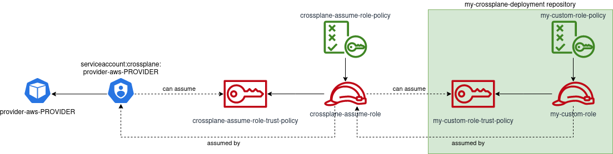

# IAM Roles for crossplane service accounts

To use IRSA with crossplane you must first have configured your cluster for it
in accordance with our documentation on [IAM roles for service accounts](https://docs.giantswarm.io/advanced/iam-roles-for-service-accounts/#using-iam-roles-for-service-accounts)

When using IRSA with crossplane there are subtle differences that need to be
taken into consideration.

The general rule of a single restrictive policies targeting infrastructure
required for the workload you're running cannot be applied as-is. This is
because crossplane requires very different permissions depending on the
infrastructure you need it to build.

One way to overcome this is to initially grant crossplane a generalised policy
that is allowed to assume other roles inside your account.

This way, you maintain the capability of targeting policies for specific
operations being carried out by crossplane inside your account(s).

To enable this capability, we need to first provide crossplane with a primary
role that the service accounts will assume, and then each infrastructure
build will provide a separate role that this initial role can assume.



It is then the responsibility of the crossplane provider config to ensure that
the correct role, or role chain is assumed by crossplane as part of your
infrastructure build.

This document targets setting up the initial primary role shown in the diagram
as `crossplane-assume-role`

## Setting up the crossplane-assume-role

Each role created for IRSA consists of 3 separate parts.

- An IAM policy
- The actual role
- A trust policy

For the primary role, the IAM policy allows `sts:AssumeRole` and restricts this
to only the roles specified in the `Resource` section.

```json
{
    "Version": "2012-10-17",
    "Statement": [
        {
            "Sid": "VisualEditor0",
            "Effect": "Allow",
            "Action": [
                "sts:SetSourceIdentity",
                "sts:AssumeRoleWithWebIdentity",
                "sts:GetSessionToken",
                "sts:DecodeAuthorizationMessage",
                "sts:GetServiceBearerToken"
            ],
            "Resource": [
                "arn:aws:iam::1234567890:role/my-assume-role-1",
                "arn:aws:iam::1234567890:role/my-assume-role-2"
            ]
        }
    ]
}
```

This way, we can dictate exactly what roles crossplane is allowed to assume.

The trust policy on the other hand, dictates which service accounts are allowed
to assume this role.

```json
{
  "Version": "2012-10-17",
  "Statement": [
    {
      "Effect": "Allow",
      "Principal": {
        "Federated": "arn:aws:iam::1234567890:oidc-provider/my-oidc-provider"
      },
      "Action": "sts:AssumeRoleWithWebIdentity",
      "Condition": {
        "ForAnyValue:StringEquals": {
          "my-oidc-provider:sub": [
            "system:serviceaccount:crossplane:upbound-provider-aws-ec2",
            "system:serviceaccount:crossplane:upbound-provider-aws-kms",
            "system:serviceaccount:crossplane:upbound-provider-aws-rds"
          ]
        }
      }
    }
  ]
}
```

> **Note** Service account listings
>
> In the trust policy for this role, I am specifically mentioning all
> service accounts for the providers which require access to the account.
>
> Whilst this is a concious decision to provide visibility within the trust
> about which service accounts are allowed to connect, you may wish to
> allow any service account in a given namespace to connect as long as it
> starts with a provider prefix.
>
> In this instance, replace the entire `Condition` statement with an
> equivalent [`StringLike`](https://docs.aws.amazon.com/IAM/latest/UserGuide/reference_policies_elements_condition_operators.html#Conditions_String)
> condition.
>
> For example:
>
> ```json
> "Condition": {
>   "StringLike": "system:serviceaccount:crossplane:upbound-provider-aws-*"
> }
> ```

### Step by step setup

The following steps use the `sponge` command from the `moreutils` package
to compensate for `jq` not having an `--inplace` flag. This will likely not
exist on your system but can normally be installed with the package manager
of your choice.

```bash
sudo apt install moreutils
```

This guide assumes that you are already logged in to your AWS account and have
administration rights to create IAM roles and policies.

1. Edit the file [`crossplane-assume-role-policy`](./policies/crossplane-assume-role-policy.json)
   and set the variable `${AWS_ACCOUNT_ID}` to the ID of the AWS account you're
   going to use.

   ```bash
   export POLICY_NAME="crossplane-assume-role-policy"
   export AWS_ACCOUNT_ID=$(aws sts get-caller-identity | jq -rn .Account)

   cat ./policies/${POLICY_NAME}.json | envsubst \
       | sponge ./policies/${POLICY_NAME}.json
   ```

1. Apply this policy to AWS

   ```bash
   aws iam create-policy \
     --policy-name $POLICY_NAME \
     --policy-document file://policies/${POLICY_NAME}.json \
     --description "Custom policy for assuming roles"
   ```

1. Edit the trust policy for this role to include any additional service accounts

   The following command modifies the policy [`crossplane-assume-role-trust-policy.json`](./policies/crossplane-assume-role-trust-policy.json).

   If you already know the name of the service account you wish to use, you may
   feel more comfortable editing this file manually.

   ```bash
   export PROVIDER_NAME=my-other-provider
   export TRUST_POLICY_NAME=crossplane-assume-role-trust-policy

   jq '.Statement[].Condition."ForAnyValue:StringEquals".
       "${OIDC_PROVIDER_URL}:sub" |= ( .+ ["system:serviceaccount:crossplane:'$(
           kubectl -n crossplane get ControlLerConfig ${PROVIDER_NAME} -o \
               jsonpath='{.spec.serviceAccountName}'
       )'"] | unique)' policies/${TRUST_POLICY_NAME}.json \
           | sed '/".*:",/d' | sponge policies/${TRUST_POLICY_NAME}.json
   ```

1. Next, create a new WebIdentity role called `crossplane-assume-role` and bind
   this policy to it. The Open ID Connect Identity Provider should be set to the
   one for your cluster.

   - substitute the variables `AWS_ACCOUNT_ID` and `OICD_PROVIDER_URL` in the
     trust policy:

     ```bash
      export OIDC_PROVIDER_URL=$(aws iam list-open-id-connect-providers \
          | jq '.OpenIDConnectProviderList[] | .Arn | split("/")[1] |
            select(. | test("^\\w+.MC_NAME.(?!MC_NAME)"))')

      cat policies/${TRUST_POLICY_NAME}.json | envsubst \
          | sponge policies/${TRUST_POLICY_NAME}.json
     ```

   - Check that the role does not already exist

     ```bash
     aws iam list-roles | jq '.Roles[] | select( .RoleName == "crossplane-assume-role")'
     ```

     If the role does not exist, we need to create it and attach the policy

     ```bash
       aws iam create-role --role-name crossplane-assume-role \
            --policy-document file://policies/${TRUST_POLICY_NAME}.json
       aws iam attach-role-policy --policy-arn \
           "arn:aws:iam::aws:policy/crossplane-assume-role-policy" \
           --role-name crossplane-assume-role
     ```

     If the role already exists, update its trust policy with the following command.

     ```bash
       aws iam update-assume-role-policy --role-name crossplane-assume-role \
           --policy-document file://policies/${TRUST_POLICY_NAME}.json
     ```
